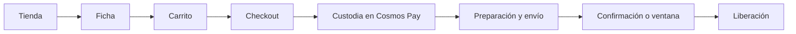
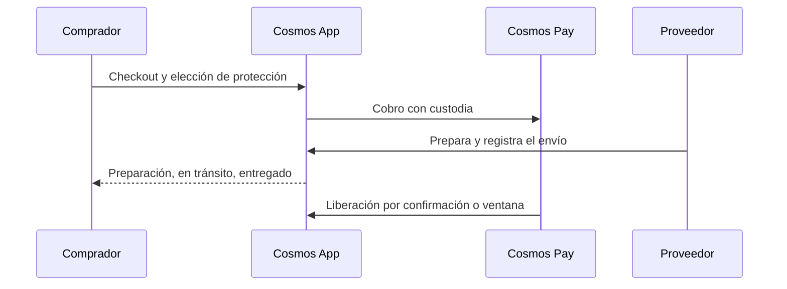

# Cosmos App: análisis de flujo de producto

Para: Leonardo Cagliero  
Observación: 23 de septiembre de 2026  
Sitio: https://cosmosapp.lat  
Riel de pago: https://cosmospay.lat  

Fuentes: navegación en vivo, rutas extraídas del bundle de la SPA y capturas de landing, tienda, venta y alta. No se hizo un pago, una compra, una transacción de wallet, un envío de KYC ni una transferencia. Los pasos de compra que la tienda vacía impidió recorrer se describen como flujo previsto.

## 1. Qué es

Cosmos App es un marketplace de tres roles (comprador, retailer sin stock y proveedor) cuyo cobro corre sobre Cosmos Pay, en https://cosmospay.lat. La landing lo presenta con el titular “Tu mundo digital en movimiento.” y con esta promesa: ayudar a vender sin stock propio, conectar proveedores y cobrar con protección, mediante Cosmos Pay, tiendas públicas y envíos coordinados con visibilidad para el comprador. La comisión publicada en esa página es “1% + US$ 0,10 por transacción · Protección incluida”. La misma landing indica que el producto está construido sobre Stellar y Etherfuse. El 23 de septiembre de 2026 la tienda pública no tenía productos, así que ficha, checkout y liberación de fondos se reconstruyen desde el copy de marketing, la página Cómo funciona y las rutas del bundle.

## 2. Roles

El alta (paso 1) y la página Vender nombran tres roles. Cosmos Founding aparece aparte, como financiamiento de proyectos.

| Rol | Dónde se ve | Qué dice la interfaz |
| --- | --- | --- |
| Comprador | `/onboard`, paso 1 | “Comprar productos en tiendas de la red”. |
| Retailer / Vendedor | Paso 1 y tarjeta “Vender sin stock” en `/vender` | “Vender sin stock, conectando con proveedores”. En la tarjeta: “Sos retailer: conectás con proveedores, armás tu vitrina y cobrás el margen. Sin capital atado a mercadería.” Badge “Ideal para empezar”. |
| Proveedor | Paso 1 y tarjeta “Tenés productos” en `/vender` | Badge B2B. “Sos productor o importador: publicás catálogo y precios; los retailers revenden en sus tiendas con tu visto bueno.” En el alta, la tarjeta empieza con “Tenés productos, vendés a retailers” y queda cortada en el viewport. |

`/vender` abre con “Elegí tu rol en la red” y “Vender en Cosmos”. El párrafo une los dos caminos de oferta: “Dos caminos complementarios: revendé sin inventario o sumate como quien abastece la red. Misma protección de pagos y las mismas reglas claras para todos.”

Cosmos Founding, en la landing, se presenta como financiamiento de proyectos de producción, retail y logística. Los enlaces “Explorar proyectos” y las tarjetas de proyecto van a `/cosmos-founding`. No forma parte de las tres tarjetas de rol del paso 1. En ese paso, Proveedor queda cortado al pie del viewport, así que no se puede afirmar si hay más opciones debajo.

## 3. Flujos paso a paso

### Comprar

Previsto a partir de la tienda, el carrito vacío, el copy de protección y la ruta `/checkout`. No se ejecutó de punta a punta.

1. El header ofrece búsqueda (“Encuentra el producto que estás buscando...”), “Comprar” hacia `/tienda`, “Ver tienda” hacia `/tienda` y “Categorías”. También muestra “Enviar a / Ingresar ubicación”; en la observación no había una dirección cargada y el control no se completó.
2. `/tienda` titula “Explora productos”. Copy: “Compra con confianza. Todos los productos cuentan con protección Cosmos.” Migas: Inicio / Tienda. Controles: “Buscar productos, marcas o vendedores”, “Filtros” y orden con “Relevancia” por defecto.
3. Elegir un producto y abrir su ficha. No hubo tarjetas, así que no apareció una URL de detalle.
4. Sumar al carrito (`/carrito`). Estado observado: “Tu carrito está vacío”, “Agregá productos desde la tienda para continuar”, CTA “Ir a la tienda” hacia `/tienda`.
5. Continuar a `/checkout`. La ruta está en el bundle. No se abrió una pantalla de checkout.
6. Según la landing y `/como-funciona`, el checkout elige el flujo de custodia o protección. Cosmos retiene el dinero mientras el pedido avanza bajo las reglas de esa protección.
7. El pago corre por Cosmos Pay, en moneda local o USDC, con la comisión de landing de 1% + US$ 0,10. Esa cifra no reapareció dentro de un pago.
8. El copy dice que el proveedor prepara y despacha, y que el comprador ve preparación, en tránsito y entregado.
9. La liberación queda atada a la confirmación de entrega o a una ventana acordada. El bundle nombra el helper `/escrow/multi-release/withdraw-remaining-funds`.
10. Después de la compra, el bundle prevé `/panel`, `/perfil`, `/perfil#mis-compras`, `/perfil/compras/`, `/orders`, `/favoritos` y `/notificaciones`. Esas pantallas no se abrieron.

### Vender sin stock

Este camino tiene pasos escritos en una página pública.

1. “Vender” abre `/vender`.
2. La tarjeta “Vender sin stock” abre `/vender/sin-stock`. Título: “Vender sin stock”. Copy: “Sos el intermediario. Proveedores te abastecen, vos vendés a clientes.”
3. La cadena publicada es Proveedores, luego Vos (Retailer), luego Clientes.
4. El retailer busca el catálogo del proveedor, elige productos y los publica en su tienda. El copy dice que no hace falta capital inicial ni comprar stock.
5. El proveedor envía directo al cliente. El retailer cobra la diferencia, su margen.
6. El comprador paga a Cosmos. Cuando el comprador recibe el producto, el retailer cobra. La protección se describe como cobertura frente al impago.
7. Sin cuenta, “Crear cuenta” va a `/onboard?role=retailer`. Con cuenta, el CTA “Ya tengo cuenta” sigue con “Ir a mi tienda” y va a `/retailer`. “Cómo funciona la protección” va a `/como-funciona`.
8. El bundle prevé el área retailer en `/retailer`, `/retailer/proveedores`, `/retailer/tiendas` y `/retailer/ventas`. Esas pantallas no se abrieron.

### Proveedor

1. En `/vender`, “Tenés productos” apunta a `/proveedores`.
2. Sin sesión, `/proveedores` redirige a `/login`. No se llegó a un formulario de alta ni a publicar un producto.
3. El rol, según la tarjeta, es productor o importador: publica catálogo y precios, y los retailers revenden con su visto bueno.
4. El bundle lista, sin recorrido en el navegador, subrutas de `/proveedores` para pedidos, perfil, productos, retailers, solicitudes, stock, tiendas autorizadas y ventas. También figuran `/providers`, `/providers/catalog` y caminos de API bajo `/providers/me/*` y `/store-products/*`.
5. Alta y edición de producto en el bundle: `/productos/nuevo`, `/productos/editar` y `/products`.

### Onboard, acceso y wallet

1. “Crea tu cuenta” y “Empezar gratis” abren `/onboard`. Título: “Crear cuenta en Cosmos”. Indicador: “Paso 1 de 3”.
2. El paso 1 pregunta “¿Qué querés hacer en Cosmos?”. Tarjetas leídas: Comprador, Retailer / Vendedor y Proveedor (esta última cortada). “Siguiente” permanece deshabilitado hasta elegir un rol. “Cancelar” vuelve a `/`. Hay enlace a `/login`.
3. Los pasos 2 y 3 no se recorrieron. No apareció copy ni pantalla de KYC.
4. `/login` titula “Iniciar sesión” y dice “Accede a tu cuenta de Cosmos”. Botones observados: “Entrar”, “Continuar con Google” y “Conectar wallet Stellar”. En esa pantalla no había una opción Freighter. No se enviaron credenciales.
5. El bundle incluye `/auth/login`, `/auth/register`, `/auth/google`, `/auth/wallet/*` y `/wallets`.
6. La landing enlaza la extensión de Chrome de Cosmos Pay (wallet Stellar), https://cosmospay.lat/wallet/ y la plataforma en https://cosmospay.lat (SDK, claves y documentación).
7. https://cosmospay.lat/wallet/ titula “Cosmos Pay · Stellar Wallet”. Se describe como wallet Stellar de autocustodia: las llaves y el cripto quedan en control de la persona. Botones: “Create a new wallet”, “I already have a wallet” y “Sign in with a social account”. Pie: “A Cosmos product · v1.8.0”. No se creó ni se desbloqueó una wallet, y no se ingresó frase semilla, contraseña ni dirección.
8. Dentro de la app, el bundle prevé `/perfil/wallet`. “Ir a mi ramp” (`/profile/ramp`) redirige a `/login` sin sesión.

## 4. Cosmos Pay, escrow, logística y ramp

Cosmos Pay es el riel de cobro y la wallet. En esta pasada no se abrió como pantalla de checkout.

- **Sitios.** Cosmos App tiene la página informativa `/cosmos-pay` y enlaces a cosmospay.lat. El copy de la app dice que Cosmos Pay convierte moneda local a cripto y al revés, que permite pagar y cobrar en USDC y recibir en cuenta bancaria, y que la protección cubre el envío. La wallet sirve para recibir el producido de las ventas y para enviar fondos.
- **Ramp.** La landing describe depósitos y retiros locales, conversión automática entre USDC y USD o moneda local, comisiones transparentes y acreditación en cuenta bancaria, con pagos alineados al envío. El acceso es `/profile/ramp` y, sin sesión, cae en `/login`. En las pantallas recorridas no aparece la marca BlindPay.
- **Comisión.** La única cifra publicada es 1% + US$ 0,10 por transacción, con protección incluida. Está en la landing. No se contrastó en un pago.
- **Red y activos.** En la UI se ven Stellar, Etherfuse y USDC. No hay otra cadena confirmada en las pantallas recorridas.
- **Escrow.** El bloque “Protección y logística de punta a punta” usa la palabra escrow y la confirmación de entrega. `/como-funciona` dice que los pagos quedan protegidos hasta la entrega y describe la cadena entre proveedores, retailers y clientes. La landing agrega que el checkout elige la custodia, que el proveedor prepara el paquete y registra el envío, que los fondos siguen al pedido y que la liberación depende de la confirmación o de una ventana acordada. El bundle nombra helpers de escrow: consulta por ids de contrato (`/helper/get-escrow-by-contract-ids`), consultas por rol o firmante, balances, envío de transacción y retiro de fondos restantes en `/escrow/multi-release/withdraw-remaining-funds`. Ninguno de esos recorridos se abrió en el navegador.
- **Logística.** “Cómo gestionamos la logística” ancla en `#logistica`. En el modelo sin stock, el proveedor despacha directo al cliente y el comprador debería ver preparación, en tránsito y entregado. No hubo un pedido real para verificar esos estados.

## 5. Mapa de rutas clave

Origen: bundle de la SPA del 23 de septiembre de 2026, más las URLs abiertas en el navegador. Parte de auth, escrow y catálogo figura en el bundle como API o como ruta de apoyo. No se confirmó que todas rendericen una pantalla.

| Área | Rutas |
| --- | --- |
| Marketing | `/`, `/como-funciona`, `/cosmos-pay`, `/cosmos-founding`, `/blog`, `/comunidad`, `/equipo`, `/faq`, `/prensa`, `/cookies`, `/more` |
| Descubrimiento | `/categorias`, `/tienda`, `/favoritos`, `/favorites`, `/carrito`, `/checkout` |
| Acceso | `/vender`, `/vender/sin-stock`, `/onboard`, `/onboard?role=retailer`, `/login` |
| Comprador con sesión | `/panel`, `/perfil`, `/perfil/wallet`, `/perfil#mis-compras`, `/perfil/compras/`, `/profile/ramp`, `/notificaciones`, `/orders` |
| Retailer | `/retailer`, `/retailer/proveedores`, `/retailer/tiendas`, `/retailer/ventas` |
| Proveedor | `/proveedores` y subrutas de pedidos, perfil, productos, retailers, solicitudes, stock, tiendas-autorizadas y ventas; también `/providers` y `/providers/catalog` |
| Productos | `/productos/nuevo`, `/productos/editar`, `/products` |
| Auth y wallet en el bundle | `/auth/login`, `/auth/register`, `/auth/google`, `/auth/wallet/*`, `/wallets` |
| Escrow en el bundle | `/helper/get-escrow-by-contract-ids`, helpers de escrows por rol o firmante, balances, send-transaction, `/escrow/multi-release/withdraw-remaining-funds` |
| Catálogo en el bundle | `/providers/me/*`, `/store-products/*` |
| Fuera de la app | https://cosmospay.lat, https://cosmospay.lat/wallet/, extensión de Chrome de Cosmos Pay |

Header observado: ubicación (“Enviar a / Ingresar ubicación”), Categorías, Comprar a `/tienda`, Vender a `/vender`, Cómo funciona a `/como-funciona`, idioma, alternar tema, “Crea tu cuenta” a `/onboard`, “Iniciar sesión” a `/login` y carrito a `/carrito`.

## 6. Estado actual observado

- La landing carga con buscador, navegación, comisión y los botones “Empezar gratis” y “Ver tienda”.
- `/tienda` está vacía: “Aún no hay productos”. “Cuando haya productos publicados, los encontrarás aquí.” Sin fichas y sin agregar al carrito.
- `/carrito` está vacío y solo vuelve a `/tienda`.
- `/vender` y `/vender/sin-stock` son públicas y legibles.
- `/proveedores` y `/profile/ramp` redirigen a `/login` sin sesión.
- El alta queda en el paso 1 de 3. El login se vio, sin credenciales. Google y “Conectar wallet Stellar” están visibles. Freighter no está en ese login.
- La wallet de Cosmos Pay muestra su landing (v1.8.0), sin crear ni desbloquear.
- `/como-funciona` y `/cosmos-pay` se abrieron como páginas informativas.
- `/cosmos-founding` está enlazada. Durante la investigación la pestaña activa saltaba a X, así que el contenido de esa ruta no quedó registrado. La misma interferencia impidió un click-through estable de ubicación, categorías, idioma, tema, el modal de conectar wallet y algunos CTA, y también impidió leer la respuesta de `/nonexistent`.
- No hubo pago, compra, KYC ni movimiento de fondos.

## 7. Huecos de UX y producto

Solo lo que la UI, el copy o el bundle muestran.

1. **La compra no se puede completar.** `/tienda` no tiene productos y el carrito vacío devuelve a esa tienda. No hay ficha, no hay “agregar” y no se alcanza `/checkout`. La frase “Compra con confianza. Todos los productos cuentan con protección Cosmos.” queda sin un producto al que aplicarla.
2. **Protección y comisión viven en el marketing.** Escrow, custodia en el checkout y liberación por confirmación o ventana están en la landing y en `/como-funciona`. La comisión 1% + US$ 0,10 también está solo en la landing. No hubo una pantalla de pago donde esa elección o esa cifra aparezcan.
3. **Proveedor y ramp pierden el contexto al pedir sesión.** “Tenés productos” lleva a `/proveedores`, e “Ir a mi ramp” lleva a `/profile/ramp`. Sin sesión, ambos caen en el login genérico (“Iniciar sesión”, “Accede a tu cuenta de Cosmos”). Un visitante no ve catálogo, stock, publicación ni la pantalla de depósitos y retiros. `/productos/nuevo` quedó solo como ruta de bundle.
4. **El alta anuncia tres pasos y solo el primero es verificable.** “Siguiente” exige un rol, y la tarjeta Proveedor queda cortada en el viewport del paso 1. Los pasos 2 y 3, y con ellos cualquier verificación de identidad, no están a la vista.
5. **La wallet de cobro está en inglés y fuera del idioma de la app.** El login de Cosmos App dice “Conectar wallet Stellar”. La wallet en cosmospay.lat (v1.8.0) usa “Create a new wallet”, “I already have a wallet” y “Sign in with a social account”. No se observó Freighter ni un estado de wallet ya conectada dentro de la app.
6. **El bundle mezcla pares de rutas en español y en inglés** para ideas parecidas: `/favoritos` y `/favorites`, `/perfil` y `/profile/ramp`, `/proveedores` y `/providers`, `/productos` y `/products`. No se comprobó en el navegador cuáles de esas rutas abren pantalla.
